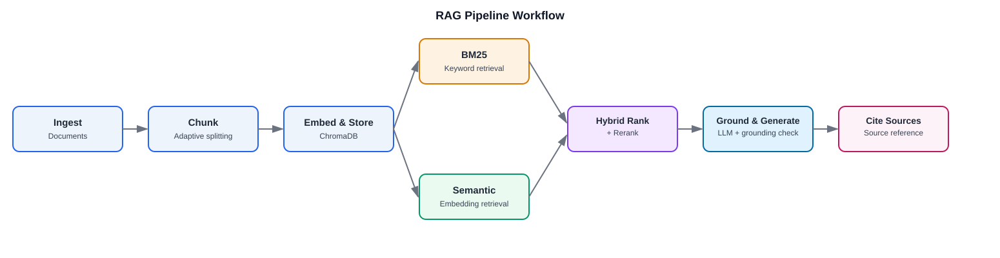

# Personal Document Assistant (RAG)

A retrieval-augmented generation system that lets a user upload their own documents and ask questions about them in plain language. Instead of scrolling through a PDF or a set of notes, the user gets a direct answer with the exact source cited.

**Live demo:** [peishuen-rag-personal-document-assistant-app-h78qzs.streamlit.app](https://peishuen-rag-personal-document-assistant-app-h78qzs.streamlit.app/)

## Overview

This project demonstrates a full RAG pipeline built with LangChain and ChromaDB. It is designed to handle multiple document formats, compare retrieval methods, and reduce hallucination by grounding every answer in the retrieved source text.

The project is intentionally domain agnostic. The same pipeline works whether the uploaded document is a clean PDF, a lecture note, or a scanned report.

## Features

| Feature | Description |
|---|---|
| Multi-format ingestion | Accepts PDFs, plain text notes, and scanned reports as input |
| Adaptive chunking | Splits documents into chunks with a strategy that adjusts to document type and structure |
| Hybrid retrieval with reranking | Retrieves relevant chunks using both BM25 (keyword based) and semantic search (embedding based), combines the two into a single ranked list, and reranks the top results |
| Grounding check | Verifies that a generated answer is actually supported by the retrieved chunks before returning it |
| Retrieval evaluation | Measures retrieval quality using Precision@K and Recall@K for BM25, semantic search, and the combined hybrid ranking |
| Source citation | Every answer points back to the exact chunk or page it came from |
| Batch upload and cross-document Q&A | Supports uploading multiple documents at once and answering questions that draw from across all of them |

## Tech Stack

| Component | Role |
|---|---|
| LangChain | Orchestrates the retrieval and generation pipeline |
| ChromaDB | Local vector store for embedding storage and similarity search |
| BM25 | Sparse keyword based retrieval, used for comparison against semantic search |
| Qwen embeddings (DashScope) | Converts document chunks and queries into vectors for semantic search, via Alibaba's DashScope API |
| OCR (Tesseract) | Extracts text from scanned reports before chunking, used only when the uploaded document has no selectable text |
| Qwen LLM (DashScope) | Generates the final answer from the retrieved context, via LangChain's ChatTongyi wrapper |

## Project Structure

```
RAG-Personal-Document-Assistant/
├── README.md
├── tasks.md
├── requirements.txt
├── runtime.txt                   # pins the Python version used on Streamlit Community Cloud
├── .env                          # local only, holds DASHSCOPE_API_KEY and friends, never committed
├── app.py                        # streamlit entry point, run with `streamlit run app.py`
│
├── data/
│   ├── sample_docs/               # pdf, text, and scanned report samples used for testing
│   ├── uploads/                   # documents uploaded through the streamlit app
│   └── chroma_db/                 # chromadb's persistent local store
│
├── src/
│   ├── ingestion/
│   │   ├── pdf_loader.py
│   │   ├── text_loader.py
│   │   ├── ocr_loader.py
│   │   └── batch_loader.py        # picks the right loader by file extension, loads multiple files at once
│   │
│   ├── chunking/
│   │   └── chunker.py
│   │
│   ├── embeddings/
│   │   └── embedder.py
│   │
│   ├── vectorstore/
│   │   └── chroma_store.py
│   │
│   ├── retrieval/
│   │   ├── bm25_retriever.py
│   │   ├── semantic_retriever.py
│   │   ├── hybrid_ranker.py
│   │   └── cross_document.py      # merges retrieval results across multiple uploaded documents
│   │
│   ├── generation/
│   │   ├── prompt_templates.py
│   │   ├── grounding_check.py
│   │   └── generator.py
│   │
│   └── citation/
│       └── citation_tracker.py
│
├── evaluation/
│   ├── qa_dataset.json           # labeled question and answer pairs, with ground truth chunks
│   ├── evaluation.py             # computes precision@k, recall@k, and answer correctness
│   ├── embedding_comparison.py   # compares two embedding models on the same document set
│   └── results/
│       ├── evaluation_report.md
│       └── detailed_results.json # per-question retrieval and generation results
│
├── assets/
│   └── workflow-diagram.svg
│
└── testing/
    ├── ingest_sample_docs.py     # loads, chunks, embeds and stores the sample docs into chromadb
    ├── test_embedding_comparison.py
    └── test_phase1.py ... test_phase10.py   # one script per phase, run manually during development
```

## Workflow



| Step | Description |
|------|-------------|
| Ingest | The user uploads one or more documents |
| Chunk | Documents are split into smaller pieces, with chunk size and overlap adjusted based on document type |
| Embed & Store | Each chunk is converted into a vector and stored in ChromaDB |
| Retrieve | A user question triggers retrieval using both BM25 and semantic search |
| Hybrid Rank & Rerank | The two result sets are combined into a single ranked list, and the top results are reranked |
| Ground & Generate | The retrieved chunks are passed to the LLM along with the question, and the generated answer is checked against the retrieved text before being returned |
| Cite | The final answer is returned along with the source chunk or page it was grounded in |

## Evaluation

Retrieval quality is measured with a small labeled question and answer set, built as follows:

- 3 to 5 documents are selected, covering the different formats the project supports (a clean PDF, a lecture note, a scanned report)
- For each document, 8 to 10 question and answer pairs are written based on content known to be in that document
- For each question, the chunk or chunks that contain the correct answer are marked as ground truth
- This gives a labeled set of roughly 30 to 50 question and answer pairs across all documents

Using this labeled set, three things are measured:

| What is measured | Description |
|---|---|
| Retrieval accuracy | Precision@K and Recall@K, calculated separately for BM25, semantic search, and the combined hybrid ranking, so the improvement from combining the two methods can be shown with actual numbers |
| Answer correctness | Whether the generated answer actually matches the expected answer, checked separately from retrieval accuracy since a correct retrieval does not always lead to a correct generated answer |
| Embedding model comparison | Two embedding models are run on the same document set, and differences in retrieval results are compared and recorded |

## Setup

The easiest way to try this project is the live demo linked above, no setup needed. To run it locally instead:

```bash
# clone the repository
git clone https://github.com/peishuen/RAG-Personal-Document-Assistant.git
cd RAG-Personal-Document-Assistant

# create and activate a python 3.11 environment (conda shown, venv works too)
conda create -n rag-env python=3.11
conda activate rag-env

# install dependencies
pip install -r requirements.txt
```

Create a `.env` file in the project root with your DashScope credentials (this project uses Qwen models through Alibaba's DashScope API, not OpenAI):

```
DASHSCOPE_API_KEY=your-key-here
DASHSCOPE_API_REGION=int
DASHSCOPE_HTTP_BASE_URL=https://dashscope-intl.aliyuncs.com/api/v1
```

Then run the app:

```bash
streamlit run app.py
```

This opens the app at `http://localhost:8501`. The repo already ships with the three sample documents pre-embedded in `data/chroma_db`, so you can start asking questions right away without uploading anything first.

## Usage

1. Upload one or more documents (PDF, text file, or scanned report)
2. Ask a question about its content, or a question that spans multiple uploaded documents
3. Review the answer along with the cited source
4. Optionally, compare BM25, semantic search, and hybrid ranking results for the same question

## Future Improvements

- Add latency and cost benchmarking for larger document sets

## Author

Pei Shuen
[GitHub](https://github.com/peishuen)
